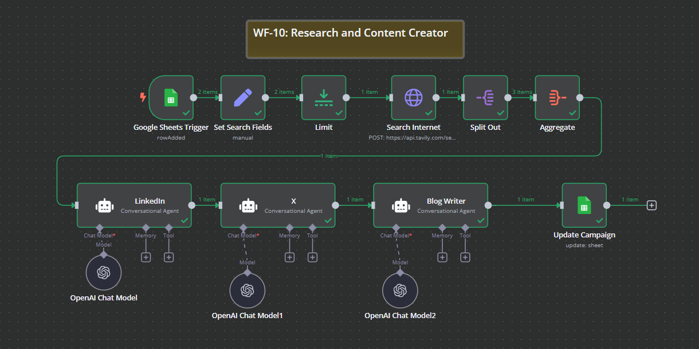

# WF-10: Research and Content Creator – n8n Workflow

## 📌 Overview
This **n8n workflow**, `WF-10: Research and Content Creator`, automates research and content generation by gathering relevant information from the internet and transforming it into well-structured blog posts, LinkedIn posts, and tweets (X). The workflow retrieves, processes, and formats content tailored for different platforms, ensuring engaging and high-quality output.

## 🔧 Workflow Components
### 🏗️ Core Modules
1. **🔍 Search Internet** – Queries an external search API to retrieve relevant information on the given topic.
2. **📊 Aggregate Results** – Aggregates search results, extracting relevant content for processing.
3. **📝 Blog Writer** – Uses OpenAI to generate concise and engaging blog articles.
4. **🔗 LinkedIn Post Generator** – Converts content into a compelling LinkedIn post.
5. **🐦 X (Twitter) Post Generator** – Creates an engaging tweet optimized for readability.
6. **🧠 OpenAI Language Model** – Enhances content generation for blogs, LinkedIn, and X.
7. **📂 Google Sheets Trigger** – Monitors a Google Sheet for new content requests.
8. **📝 Update Campaign** – Saves generated content back to Google Sheets for tracking.

## ⚙️ How It Works
1. 📂 **Google Sheets Trigger** detects new content requests.
2. 🔍 **Search Internet** fetches relevant data for the given topic.
3. 📊 **Aggregate Results** processes and filters the search data.
4. 📝 **Blog Writer** generates a well-structured blog post.
5. 🔗 **LinkedIn Post Generator** creates an engaging LinkedIn post tailored to the audience.
6. 🐦 **X Post Generator** crafts a concise and impactful tweet.
7. 🧠 **OpenAI Language Model** enhances content quality across all formats.
8. 📄 **Update Campaign** saves the generated content back to Google Sheets.

## 📷 Workflow Screenshot

## 🚀 Setup Instructions
- 📥 **Import the workflow** into `n8n`.
- 🔑 **Ensure API credentials** for OpenAI, Google Sheets, and the Search API are configured.
- ✅ **Activate the workflow** to start automating research and content generation.

## 📝 Notes
- ⚠️ The workflow is **inactive by default**.
- 🛠️ Customize search query parameters and content formatting as needed.
- 📊 Designed for **automated, high-quality content creation across multiple platforms**.
